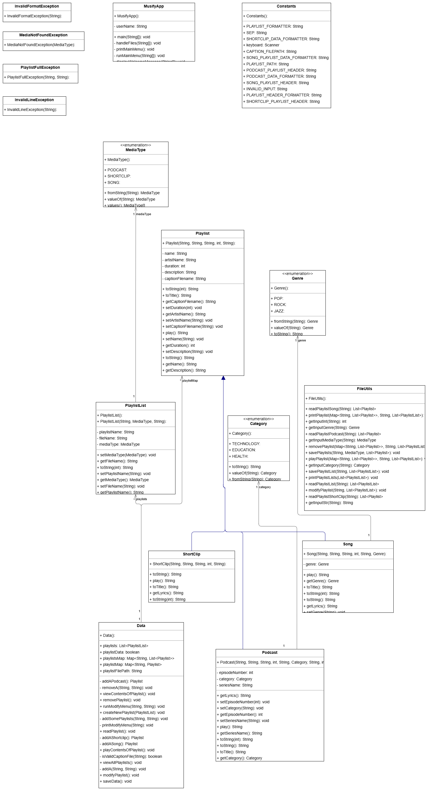

# Introduction
Welcome to the Final Project for COMP90041 - Programming and Software Development!
For this project, we will create a Musify App similar to YouTube or Spotify. In your real life, you may use some kind
of database. But we will handle and save data using files.
There are three different media types that you will handle -
- Song
· Podcast
· ShortClip
You can create one or more playlists of these types. A playlist only contains one type of Media i.e. there can be 
different playlists like playlist1, playlist2, playlists.txt or any other name, etc. But playlist1 can only have songs,
playlist2 can only have podcasts and so on.
A song has a Genre that can take one of these values - POP, ROCK, JAZz. A podcast has a category that can take
one of these values HEALTH, EDUCATION, TECHNOLOGY.
 These are the following operations that you can do -
· Create one or more playlists
· Add or remove playlists.
· View all the playlists that you have created.
· A Playlist may contain media of the same type. They can be of type either SONG, PODCAST or SHORTCLIP
(similar to YouTube Shorts or Instagram Reels)
· You can add content to a playlist
· You can remove media in a playlist.
· You can view the contents of a playlist
· You can play a playlist.
Additionally, you have to manage two tasks related to file handling -
· Read the data from the files at the beginning of the program.
· Write the data in the files while exiting the program.

